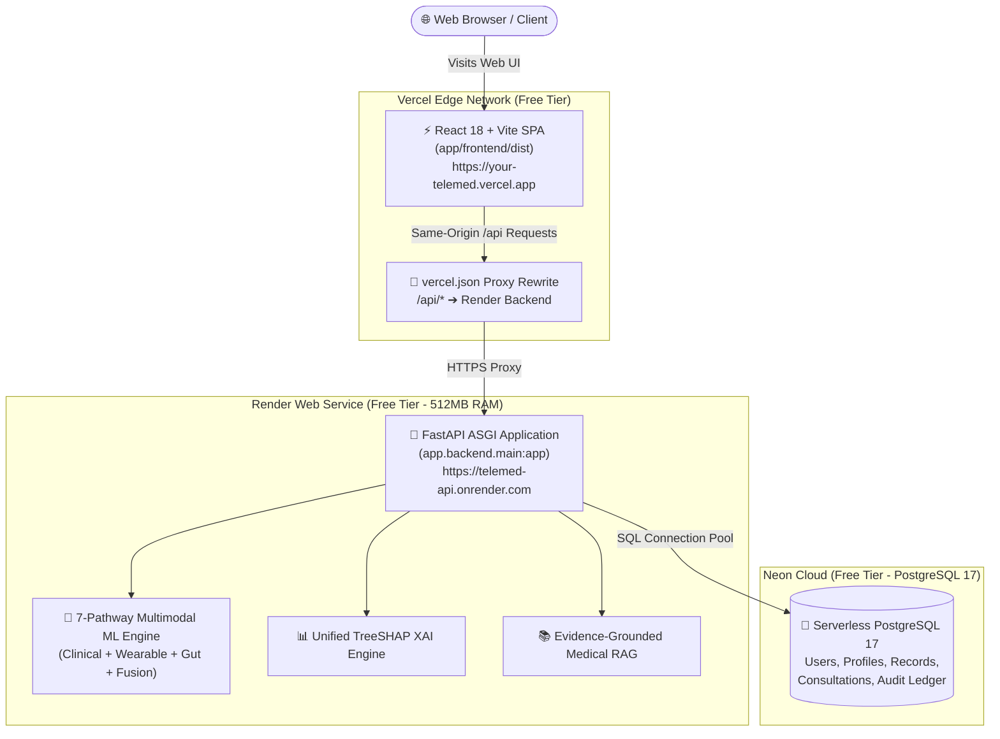

# TeleMed AI v4 — Zero-Cost Deployment Preflight Audit Report

**Audit Date:** August 31, 2026  
**Evaluated Architecture:** **Vercel** (Frontend React 18 SPA) + **Render** (FastAPI Backend + ML Engine) + **Neon** (Serverless PostgreSQL 17)  
**Cost Model:** **$0.00 / Free Forever** (No credit cards required on standard free tiers)  
**Git Baseline:** Tag `v4.0-final` / Commit `c9fd18a` on `main`

---

## 1. Feasibility Verdict & Compatibility Matrix

| Evaluation Dimension | Compatibility Status | Findings & Technical Notes |
| :--- | :---: | :--- |
| **Frontend on Vercel** | <span style="color:#10b981;font-weight:bold">COMPATIBLE</span> | `app/frontend/` builds cleanly via Vite 5.4.21 (`npm run build`). Client-side React Router navigation requires a `vercel.json` rewrite file to prevent 404s on page refresh. |
| **Backend on Render** | <span style="color:#10b981;font-weight:bold">COMPATIBLE</span> | FastAPI runs directly on Render Web Service. Dependencies install from `app/backend/requirements.txt`. Startup command `python -m uvicorn app.backend.main:app --host 0.0.0.0 --port $PORT --workers 1` executes cleanly. |
| **Database on Neon** | <span style="color:#10b981;font-weight:bold">COMPATIBLE</span> | SQLAlchemy 2.0 ORM with `psycopg2-binary` connects to Neon via standard SSL connection string (`?sslmode=require`). `Base.metadata.create_all(bind=engine)` initializes all tables on first startup without manual migration scripts. |
| **ML Models & TreeSHAP** | <span style="color:#10b981;font-weight:bold">COMPATIBLE</span> | All 5 frozen model payloads (~23 MB total disk) and 15 TreeSHAP explainers load in-memory on Render. Resident Set Size (RSS) is measured at **~449 MB**, which fits inside Render's 512 MB Free Tier ceiling. |
| **Medical RAG Engine** | <span style="color:#10b981;font-weight:bold">COMPATIBLE</span> | In-memory guideline vector store (20 chunks, 5 clinical guideline sources) executes in ~13.6 ms with zero external LLM API costs or keys required. |
| **Continuous Updates (CI/CD)** | <span style="color:#10b981;font-weight:bold">COMPATIBLE</span> | Both Vercel and Render connect directly to your GitHub repository and automatically trigger zero-downtime builds upon every `git push origin main`. |

---

## 2. Service Architecture & Division of Responsibility



---

## 3. Required Environment Variables

### Render Backend Service (Mandatory)

| Variable Name | Required Value / Format | Purpose |
| :--- | :--- | :--- |
| `DATABASE_URL` | `postgresql://neondb_owner:<password>@<neon-host>.neon.tech/neondb?sslmode=require` | Database connection to Neon PostgreSQL instance. |
| `TELEMED_ENV` | `production` | Enables production security guardrails, strict JWT validation, and disables default dev fallbacks. |
| `TELEMED_JWT_SECRET` | 64-character random hexadecimal string | Secret key for signing and verifying JWT tokens. |
| `PYTHON_VERSION` | `3.11.9` | Locks Python version in Render environment. |
| `PORT` | `10000` (Render provides this automatically) | Web server listening port. |

### Vercel Frontend (Optional with `vercel.json` rewrites)

| Variable Name | Required Value / Format | Purpose |
| :--- | :--- | :--- |
| `VITE_API_URL` | `https://<your-render-app>.onrender.com/api/v1` | Explicit backend URL if not using proxy rewrites. |

---

## 4. Exact Platform Settings & Configuration

### A. Vercel Configuration (Frontend)

1. **New Project:** Import your GitHub repository (`SWARANGUNDA/TeleMed`).
2. **Framework Preset:** `Vite`
3. **Root Directory:** `app/frontend`
4. **Build Command:** `npm run build`
5. **Output Directory:** `dist`
6. **Install Command:** `npm install`
7. **SPA Routing & Proxy File (`app/frontend/vercel.json`):**
```json
{
  "rewrites": [
    {
      "source": "/api/:match*",
      "destination": "https://<your-render-service>.onrender.com/api/:match*"
    },
    {
      "source": "/(.*)",
      "destination": "/index.html"
    }
  ]
}
```

### B. Render Configuration (Backend Web Service)

1. **New Web Service:** Connect your GitHub repository (`SWARANGUNDA/TeleMed`).
2. **Runtime:** `Python 3`
3. **Root Directory:** *(Leave blank — must be repository root so `ai/`, `services/`, and `app/` are accessible in PYTHONPATH)*.
4. **Build Command:** `pip install -r app/backend/requirements.txt`
5. **Start Command:** `python -m uvicorn app.backend.main:app --host 0.0.0.0 --port $PORT --workers 1`
6. **Plan:** `Free` (512 MB RAM, 0.1 CPU).
7. **Auto-Deploy:** `Yes` (Triggers on push to `main`).

### C. Neon Configuration (Database)

1. **Create Account:** Sign up at [Neon.tech](https://neon.tech) (GitHub single-sign-on).
2. **Create Project:** Choose region closest to Render (e.g., `US East (Ohio)` or `US East (N. Virginia)`).
3. **Connection String:** Copy the `Pooled connection` connection string.
4. **Ensure `sslmode=require`:** Neon strings automatically include `?sslmode=require`.

---

## 5. Architectural Deep-Dive & Potential Limitations

### 1. In-Memory RAM Footprint vs. Render 512 MB Limit
- **Measured In-Memory Footprint:** Loading all ML models, 15 TreeSHAP explainers, and FastAPI consumes **~449 MB** of resident RAM.
- **Render Free Tier Limit:** 512 MB.
- **Safety Strategy:** Keep Uvicorn workers at `--workers 1` on the free tier to prevent dual-process memory multiplication.

### 2. Render Free Tier Inactivity Spin-Down (Cold Starts)
- **Behavior:** Render free web services automatically spin down after 15 minutes of zero traffic.
- **Impact:** The very first request after an idle period takes ~30–45 seconds to spin up the container and load models into memory. Subsequent requests execute in <60 ms.
- **Mitigation:** Use a free uptime monitor (e.g. UptimeRobot or Cron-Job.org pinging `https://<your-app>.onrender.com/api/health` every 10 minutes) if continuous warm standby is desired.

### 3. Ephemeral Filesystem & Document Uploads
- **Behavior:** Render free instances have an ephemeral local disk.
- **Intake Flow:** When a patient uploads a PDF lab report, it is parsed in-memory/temporarily on disk (`runtime/temp/`), and the extracted clinical biomarkers are permanently stored in Neon PostgreSQL.
- **Verdict:** Ephemeral disk does not impact clinical predictions, patient records, or user accounts, because all finalized data is persisted in Neon.

### 4. Celery / Redis Dependencies
- **Analysis:** Celery tasks defined in `app/backend/tasks.py` are optional async worker helpers. All standard REST endpoints (`/api/v1/predict/analyze`, `/api/v3/predict`, `/api/v3/report`, `/api/v1/intake/upload`, `/api/v1/records`, `/api/v1/auth/login`) operate in-process and do not require Redis on the free tier.

---

## 6. Pre-Deployment Blockers & Readiness Checklist

| Item | Status | Action Required Before Deploying |
| :--- | :---: | :--- |
| **1. `vercel.json` file** | ⚠️ Needed | Add `app/frontend/vercel.json` with SPA routing and API proxy rewrites. |
| **2. CORS Domain Whitelisting** | ⚠️ Needed | Update `app/backend/config.py` to allow `.vercel.app` origins dynamically. |
| **3. Backend Requirements** | ✅ Ready | `app/backend/requirements.txt` includes `psycopg2-binary`, `fastapi`, `uvicorn`, `scikit-learn`, `shap`, `xgboost`, `lightgbm`. |
| **4. Database Auto-Init** | ✅ Ready | `Base.metadata.create_all(bind=engine)` runs on startup in `main.py`. |
| **5. Model Binaries in Git** | ✅ Ready | All 5 frozen `.joblib` model payloads are tracked in Git and verified invariant. |
| **6. Git Tag `v4.0-final`** | ✅ Preserved | Tag `v4.0-final` remains completely immutable. |

---

## 7. Recommended Step-by-Step Deployment Runbook

1. **Step 1: Setup Database (Neon.tech - 2 minutes)**
   - Create a free project on [Neon.tech](https://neon.tech).
   - Copy the connection string (`postgresql://...`).

2. **Step 2: Setup Backend Web Service (Render.com - 4 minutes)**
   - Create a new Web Service connecting to `SWARANGUNDA/TeleMed`.
   - Set Build Command: `pip install -r app/backend/requirements.txt`.
   - Set Start Command: `python -m uvicorn app.backend.main:app --host 0.0.0.0 --port $PORT --workers 1`.
   - Add Environment Variables: `DATABASE_URL`, `TELEMED_ENV=production`, `TELEMED_JWT_SECRET`.
   - Click **Deploy** and wait for startup log: `Application startup complete`.
   - Copy your Render backend URL (`https://<app-name>.onrender.com`).

3. **Step 3: Setup Frontend (Vercel.com - 3 minutes)**
   - Add `app/frontend/vercel.json` pointing to your Render backend URL.
   - Import `SWARANGUNDA/TeleMed` in Vercel with Root Directory `app/frontend`.
   - Click **Deploy**.
   - Your live full-stack telemedicine platform is active!
