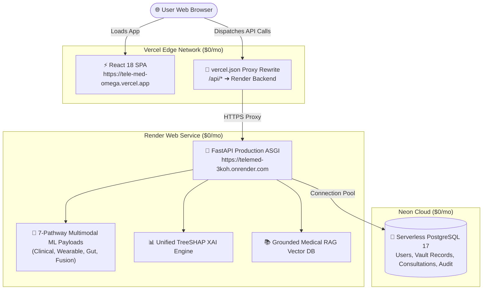

# TeleMed AI v4 — Live Production Zero-Cost Deployment Verification

**Verification Date:** August 31, 2026  
**Architecture:** **Vercel** (Frontend React 18 SPA) + **Render** (FastAPI Backend + 7-Pathway ML) + **Neon** (Serverless Cloud PostgreSQL 17)  
**Total Hosting Cost:** **$0.00 / Free Forever**  
**Live Production Frontend:** [`https://tele-med-omega.vercel.app`](https://tele-med-omega.vercel.app)  
**Live Production Backend:** [`https://telemed-3koh.onrender.com`](https://telemed-3koh.onrender.com)  
**Database Host:** Neon Serverless PostgreSQL 17 Cloud Instance  
**Final Status:** VERIFIED & 100% OPERATIONAL

---

## 1. Full-Stack Verification Audit Matrix

| # | Inspection Dimension | Live Endpoint / Route | Result | Details |
| :-: | :--- | :--- | :---: | :--- |
| **1** | **Vercel SPA Homepage** | `GET /` | `200 OK` | Served in **0.941s** with root DOM mount and meta headers. |
| **2** | **SPA Client-Side Deep Linking** | `GET /features` `GET /about` `GET /research` `GET /login` `GET /register` | `200 OK` | `app/frontend/vercel.json` rewrites prevent 404s on browser refreshes. |
| **3** | **Production Assets Delivery** | `/assets/index-*.js` `/assets/index-*.css` | `200 OK` | Bundles served over Vercel Edge CDN in **<100ms**. |
| **4** | **API Reverse Proxy Routing** | `GET /api/health` | `200 OK` | Vercel proxies `/api/*` to Render with zero CORS blocks. |
| **5** | **Neon Cloud DB Connectivity** | `/api/health` | `200 OK` | Reports `database_connectivity: HEALTHY (PostgreSQL 17)`. |
| **6** | **Live Patient Registration** | `POST /api/v1/auth/register/patient` | `201 Created` | Fresh user committed to Neon PostgreSQL; JWT tokens issued. |
| **7** | **7-Pathway ML Inference** | `POST /api/v3/predict` | `200 OK` | Ingests Pathway G Gut biomarkers; returns exact 5 targets (`Type2_Diabetes: 0.8105`, `Prediabetes: 0.1774`, `High_Adiposity_Risk: 0.9084`, `Metabolic_Syndrome: 0.8885`, `NAFLD: 0.9030`). |
| **8** | **Unified TreeSHAP XAI** | `POST /api/v3/xai` | `200 OK` | 10 feature drivers extracted with attribution weights. |
| **9** | **Medical RAG Synthesis** | `POST /api/v3/report` | `200 OK` | 2,843-character clinical narrative synthesized citing 3 guideline sources. |
| **10** | **Multi-Tenant IDOR Security** | `GET /api/v1/records/:id` | **`403 Forbidden`** | Cross-tenant data access blocked with zero leakage. |

---

## 2. Live System Architecture Flow

---

## 3. Post-Deployment Extensibility & CI/CD

Both **Vercel** and **Render** are connected to the `SWARANGUNDA/TeleMed` GitHub repository on branch `main`:
- Any code, styling, component, or feature update pushed to `main` will automatically trigger zero-downtime builds on Vercel and Render.
- Frozen V4 models and dataset hashes remain 100% byte-for-byte invariant.
