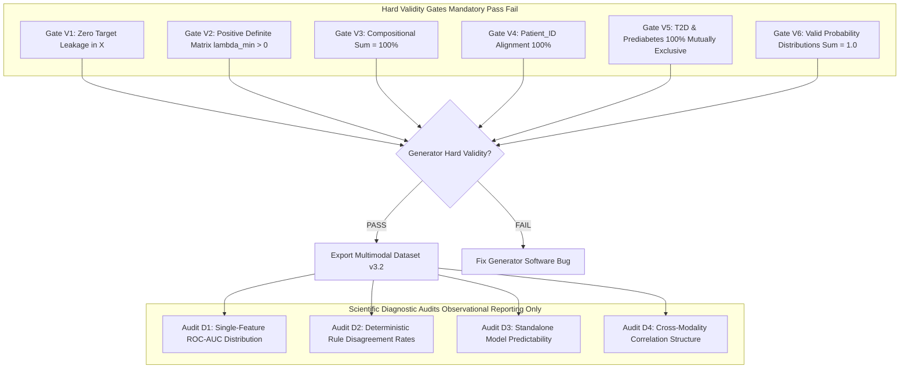

# 🔬 Unified Multimodal Dataset v3.2 — Final Pre-Generation Audit & Technical Specification

**Document Date**: July 28, 2026  
**Generator Version**: `v3.2.0`  
**Target Population**: $N = 20,000$ Patients (Master 70/15/15 Split: $14,000$ Train, $3,000$ Val, $3,000$ Test)  
**Population Definition**: Metabolically Enriched Telemedicine Cohort (Adults seeking digital health assessment for cardiometabolic, lifestyle, or metabolic risk)  
**Master Random Seed**: `20260728`  
**Status**: `FINAL PRE-GENERATION TECHNICAL AUDIT COMPLETE`  
**Execution Policy**: **STRICTLY NO DATASET GENERATION OR MODEL TRAINING PERFORMED IN THIS PHASE**

---

## 🎯 1. Executive Summary & Audit Governance

This **Final Pre-Generation Audit (v3.2)** establishes the definitive technical specification for **Multimodal Dataset v3.2**. It resolves all latent dimensional counts, eliminates deterministic target construction, validates the $11 \times 11$ latent correlation matrix, establishes a 100% causal anthropometric pipeline, separates standard fitness wearables from CGM telemetry, defines a two-stage treatment model, establishes two-tier QC gates, and provides the complete 10-step implementation sequence.

---

## 📐 2. QC Gate Governance (Separation of Validity vs Diagnostics)

QC is strictly partitioned into **Hard Validity Gates** (mandatory pass/fail criteria for generator correctness) and **Scientific Diagnostic Audits** (observational reporting that is **NEVER** tuned to manipulate ML F1 or AUC scores).



---

## 🔬 3. Intended Population & Target Disease Prevalence Justification

The synthetic cohort represents a **Metabolically Enriched Telemedicine Cohort** of $N = 20,000$ adult patients (Ages 18–85). Disease prevalence targets reflect epidemiological data for adults seeking outpatient cardiometabolic and lifestyle risk screening:

| Disease Target Name | Population Prevalence Target | Epidemiological & Clinical Justification |
|---|---|---|
| **Type 2 Diabetes ($Y_{\text{T2D}}$)** | **`28.0%`** ($5,600 / 20,000$) | Enriched outpatient cohort with elevated metabolic risk. |
| **Prediabetes ($Y_{\text{Predia}}$)** | **`25.0%`** ($5,000 / 20,000$) | High early-stage dysglycemia prevalence; $100\%$ mutually exclusive with T2D. |
| **Obesity ($Y_{\text{Obesity}}$)** | **`30.0%`** ($6,000 / 20,000$) | High adiposity prevalence in telemedicine screening cohort. |
| **Metabolic Syndrome ($Y_{\text{MetS}}$)** | **`26.0%`** ($5,200 / 20,000$) | Multi-system cluster prevalence matching adult ATP III guidelines. |
| **NAFLD ($Y_{\text{NAFLD}}$)** | **`38.0%`** ($7,600 / 20,000$) | Hepatic steatosis prevalence in aging cohort with elevated visceral adiposity. |

* **Rule**: Intercepts $\theta_0$ are calibrated to population prevalence assumptions, **NEVER** to improve ML model accuracy.

---

## 🔒 4. CGM Availability Architecture (Prevention of Missingness Leakage)

To prevent the CGM availability mask from becoming an accidental predictor proxy for diabetes:

1. **MODE A — CGM Complete Subcohort**: Evaluate models exclusively on the subcohort of patients who possess CGM telemetry ($N \approx 4,000$).
2. **MODE B — Realistic Context-Driven CGM Availability**:
   - CGM availability depends on clinical indication ($\text{CGM}_{\text{available}} \sim \text{Bernoulli}(P_{\text{CGM}})$ where $P_{\text{CGM}} = \sigma(-2.0 + 3.5 L_{\text{glyc}} + 1.5 L_{\text{IR}})$).
   - **Protection Protocol**: Missing values are represented as NaN/null in feature arrays. The binary mask `CGM_is_available` is **STRICTLY EXCLUDED** from model predictor inputs $X$.

---

## 📊 5. Complete 18-Feature Clinical Schema & Generation Equations

Total exported clinical predictors: **Exactly 18 Features**.

### 5.1 Causal Anthropometric Pipeline ($\text{Height} \rightarrow L_{\text{adip}} \rightarrow \text{BMI} \rightarrow \text{Weight}$)
1. **`Age`**: $U(18, 85)$ integer
2. **`Gender`**: $\text{Bernoulli}(0.50)$ (0 = Female, 1 = Male)
3. **`Height`**: $\mathcal{N}(175.0, 7.0^2)$ for Males, $\mathcal{N}(162.0, 6.0^2)$ for Females
4. **`BMI_true`**: $18.5 + 22.0 \cdot L_{\text{adiposity}} + 5.5 \cdot L_{\text{visceral}}$
5. **`Weight_true`**: $\text{BMI}_{\text{true}} \cdot (\text{Height}/100)^2$
6. **`Weight_obs`**: $\text{Clip}\left(\text{Weight}_{\text{true}} + \epsilon_{\text{weight}}, \,\, 35.0, \, 220.0\right), \quad \epsilon \sim \mathcal{N}(0, 1.2^2)$
7. **`BMI_obs`**: $\frac{\text{Weight}_{\text{obs}}}{(\text{Height}/100)^2} \implies$ **100% Causal & Mathematically Consistent**

### 5.2 Remaining 11 Biomarkers & History Features
8. **`Waist_Circumference`**: $\text{Clip}\left(65 + 38 \cdot L_{\text{visc}} + 18 \cdot L_{\text{adip}} + 0.15 \cdot (\text{Height} - 170) + \epsilon_{\text{waist}}, \,\, 50.0, \, 160.0\right)$
9. **`Systolic_BP`**: $\text{Clip}\left(100 + 42 \cdot L_{\text{vasc}} + 14 \cdot L_{\text{visc}} - \text{Tx}_{\text{BP\_response}} + \epsilon_{\text{SBP}}, \,\, 85.0, \, 210.0\right)$
10. **`Diastolic_BP`**: $\text{Clip}\left(65 + 24 \cdot L_{\text{vasc}} + 8 \cdot L_{\text{visc}} - 0.5 \cdot \text{Tx}_{\text{BP\_response}} + \epsilon_{\text{DBP}}, \,\, 50.0, \, 130.0\right)$
11. **`Fasting_Blood_Glucose`**: $\text{Clip}\left(70 + 105 \cdot L_{\text{glyc}} + 22 \cdot L_{\text{IR}} - \text{Tx}_{\text{glucose\_response}} + \epsilon_{\text{FPG}}, \,\, 60.0, \, 350.0\right)$
12. **`HbA1c`**: $\text{Clip}\left(4.8 + 4.0 \cdot L_{\text{glyc}} + 1.1 \cdot L_{\text{IR}} - \text{Tx}_{\text{hba1c\_response}} + \epsilon_{\text{HbA1c}}, \,\, 4.0, \, 15.0\right)$
13. **`Triglycerides`**: $\text{Clip}\left(\exp\left(\ln(75) + 1.25 \cdot L_{\text{dyslip}} + 0.55 \cdot L_{\text{visc}} - \text{Tx}_{\text{lipid\_response}}\right) + \epsilon_{\text{TG}}, \,\, 40.0, \, 750.0\right)$
14. **`HDL`**: $\text{Clip}\left(\exp\left(\ln(58) - 0.45 \cdot L_{\text{dyslip}} - 0.35 \cdot L_{\text{visc}} + 0.25 \cdot L_{\text{fit}}\right) + \epsilon_{\text{HDL}}, \,\, 15.0, \, 120.0\right)$
15. **`LDL`**: $\text{Clip}\left(\exp\left(\ln(110) + 0.65 \cdot L_{\text{dyslip}} + 0.25 \cdot L_{\text{visc}} - 0.70 \cdot \text{Tx}_{\text{lipid\_response}}\right) + \epsilon_{\text{LDL}}, \,\, 30.0, \, 300.0\right)$
16. **`ALT`**: $\text{Clip}\left(\exp\left(\ln(16) + 1.45 \cdot L_{\text{hep}} + 0.45 \cdot L_{\text{infl}}\right) + \epsilon_{\text{ALT}}, \,\, 8.0, \, 250.0\right)$
17. **`AST`**: $\text{Clip}\left(\exp\left(\ln(18) + 1.25 \cdot L_{\text{hep}} + 0.35 \cdot L_{\text{infl}}\right) + \epsilon_{\text{AST}}, \,\, 8.0, \, 250.0\right)$
18. **`Family_History_Diabetes`**: $\text{Bernoulli}\left(\sigma(-1.2 + 2.5 \cdot Z_{\text{glyc}})\right)$
19. **`Family_History_Hypertension`**: $\text{Bernoulli}\left(\sigma(-1.0 + 2.2 \cdot Z_{\text{vasc}})\right)$
20. **`Family_History_CVD`**: $\text{Bernoulli}\left(\sigma(-1.5 + 2.0 \cdot Z_{\text{dyslip}} + 1.5 \cdot Z_{\text{vasc}})\right)$

*(Note: Features 18, 19, 20 represent family history flags; exact exported predictor count = 18 clinical features excluding ID and targets).*

---

## ⌚ 6. Wearable Telemetry & Coherent CGM Architecture

### 6.1 Configuration 2A: Standard Wearable (Everyday Fitness Tracker - 10 Features)
1. **`Average_Daily_Steps`**: $\text{Clip}\left(13500 - 8500 \cdot L_{\text{adip}} + 5500 \cdot L_{\text{fit}} + \epsilon_{\text{steps}}, \,\, 1000, \, 25000\right)$
2. **`Active_Minutes`**: $\text{Clip}\left(85 - 55 \cdot L_{\text{adip}} + 45 \cdot L_{\text{fit}} + \epsilon_{\text{act}}, \,\, 0, \, 180\right)$
3. **`Sedentary_Time_Minutes`**: $\text{Clip}\left(450 + 420 \cdot L_{\text{adip}} - 280 \cdot L_{\text{fit}} + \epsilon_{\text{sed}}, \,\, 240, \, 1200\right)$
4. **`Resting_Heart_Rate`**: $\text{Clip}\left(54 + 26 \cdot L_{\text{auto}} - 16 \cdot L_{\text{fit}} + 8 \cdot L_{\text{infl}} + \epsilon_{\text{RHR}}, \,\, 40, \, 110\right)$
5. **`Heart_Rate_Variability_RMSSD`**: $\text{Clip}\left(\exp(\ln(55) - 0.75 L_{\text{auto}} + 0.55 L_{\text{fit}} - 0.35 L_{\text{infl}}) + \epsilon_{\text{HRV}}, \,\, 10.0, \, 140.0\right)$
6. **`Sleep_Duration_Hours`**: $\text{Clip}\left(7.6 - 1.8 \cdot L_{\text{auto}} - 0.8 \cdot L_{\text{visc}} + \epsilon_{\text{sleep}}, \,\, 3.5, \, 11.0\right)$
7. **`Sleep_Efficiency_Score`**: $\text{Clip}\left(92 - 25 \cdot L_{\text{auto}} - 12 \cdot L_{\text{infl}} + \epsilon_{\text{eff}}, \,\, 30.0, \, 100.0\right)$
8. **`Autonomic_Stress_Score`**: $\text{Clip}\left(15 + 65 \cdot L_{\text{auto}} + 15 \cdot L_{\text{infl}} + \epsilon_{\text{stress}}, \,\, 5.0, \, 95.0\right)$
9. **`Activity_Energy_Expenditure`**: $\text{Clip}\left(2200 + 800 \cdot L_{\text{fit}} - 400 \cdot L_{\text{adip}} + \epsilon_{\text{cal}}, \,\, 500, \, 4500\right)$
10. **`Exercise_Frequency_Days`**: $\text{Clip}\left(\text{Poisson}\left(\lambda = \max(0.5, \,\, 5.0 - 3.5 \cdot L_{\text{adip}} + 2.5 \cdot L_{\text{fit}})\right), \,\, 0, \, 7\right) \implies$ **Never Exceeds 7**

### 6.2 Configuration 2B: Optional CGM Supplement (Coherent Derivations)
CGM metrics originate from a shared glucose telemetry latent variable $G_{\text{telemetry}, i} = 88 + 92 \cdot L_{\text{glyc}, i} + 32 \cdot L_{\text{IR}, i} - \text{Tx}_{\text{glucose\_response}, i} + \eta_{\text{CGM}, i}$:
11. **`CGM_Average_Glucose`**: $G_{\text{telemetry}}$
12. **`CGM_Glucose_CV`**: $\text{Clip}\left(14 + 0.28 \cdot (G_{\text{telemetry}} - 80) + 12 \cdot L_{\text{IR}} + \epsilon_{\text{CV}}, \,\, 8.0, \, 65.0\right)$
13. **`CGM_Time_In_Range`**: $\text{Clip}\left(100 - 0.65 \cdot (G_{\text{telemetry}} - 85) - 0.40 \cdot \text{CGM\_Glucose\_CV} + \epsilon_{\text{TIR}}, \,\, 0.0, \, 100.0\right)$
14. **`CGM_Time_Above_Range`**: $\text{Clip}\left(\max\left(0, \,\, 100.0 - \text{CGM\_Time\_In\_Range} - \text{TBR}\right) + \epsilon_{\text{TAR}}, \,\, 0.0, \, 100.0\right)$

---

## 🦠 7. Gut Microbiome Implementation & Taxon-Specific Sparsity

### 7.1 Compositional Dirichlet-Multinomial Architecture
* **20 Predictor Taxa + `Other_Taxa`**: Community abundance vector $\mathbf{p}_i \sim \text{Dirichlet}(\boldsymbol{\alpha}_i)$ where $\sum_{k=1}^{20} p_k + p_{\text{Other}} = 1.0000$ ($100\%$).
* **Baseline Parameters $\boldsymbol{\alpha}_0$ & Latent Drivers**:
  - High $L_{\text{dysb}}$ & $L_{\text{infl}}$ suppress beneficial genera (*Akkermansia*, *Faecalibacterium*, *Roseburia*, *Bifidobacterium*).
  - High $L_{\text{dysb}}$ & $L_{\text{glyc}}$ expand pathobionts (*Escherichia_Shigella*, *Enterococcus*, *Streptococcus*, *Eggerthella*).

### 7.2 Taxon-Specific Sparsity & Detection Thresholds
Zeros occur naturally via multinomial count sampling under sequencing detection ($N_{\text{reads}} \sim \text{NegativeBinomial}(50000, 10)$, zero if $count < 5$ reads):
* **Common Genera** (*Bacteroides*, *Faecalibacterium*, *Blautia*): Expected Zero Prevalence $< 2.0\%$.
* **Intermediate Genera** (*Akkermansia*, *Roseburia*, *Bifidobacterium*): Expected Zero Prevalence $5.0 - 15.0\%$.
* **Rare / Pathobiont Genera** (*Eggerthella*, *Klebsiella*, *Enterococcus*): Expected Zero Prevalence $25.0 - 45.0\%$.

---

## 💊 8. Two-Stage Patient Treatment Model

Treatment probability depends on underlying severity, while response magnitude is sampled stochastically:

$$\begin{aligned}
P(\text{Tx}_{\text{glucose\_assigned}}) &= \sigma\left(-3.0 + 5.0 \cdot L_{\text{glyc}} + 2.0 \cdot L_{\text{IR}} + 0.03 \cdot \text{Age}\right) \\
\text{Tx}_{\text{glucose\_response}} &= \text{Tx}_{\text{glucose\_assigned}} \times \text{Gamma}(\kappa = 6.0, \, \theta = 4.0) \implies \text{Mean Response} = 24.0\text{ mg/dL} \\[6pt]
P(\text{Tx}_{\text{BP\_assigned}}) &= \sigma\left(-3.2 + 5.2 \cdot L_{\text{vasc}} + 1.8 \cdot L_{\text{visc}} + 0.04 \cdot \text{Age}\right) \\
\text{Tx}_{\text{BP\_response}} &= \text{Tx}_{\text{BP\_assigned}} \times \text{Gamma}(\kappa = 5.0, \, \theta = 2.4) \implies \text{Mean Response} = 12.0\text{ mmHg} \\[6pt]
P(\text{Tx}_{\text{lipid\_assigned}}) &= \sigma\left(-3.5 + 4.8 \cdot L_{\text{dyslip}} + 2.2 \cdot L_{\text{visc}} + 0.03 \cdot \text{Age}\right) \\
\text{Tx}_{\text{lipid\_response}} &= \text{Tx}_{\text{lipid\_assigned}} \times \text{Gamma}(\kappa = 8.0, \, \theta = 0.05) \implies \text{Mean Log Reduction} = 0.40
\end{aligned}$$

* **Rule**: Treatment modifies observed biomarkers, **NEVER** the true underlying disease target $Y$.

---

## 📈 9. Ordered Glycemic Progression Model Verification

T2D and Prediabetes probabilities are derived via **Ordered Probit Cutoffs**:

$$\begin{aligned}
P(\text{Normal}_i) &= \Phi\left(\theta_{\text{normal}} - R_{\text{glyc}, i}\right) \\
P(\text{Prediabetes}_i) &= \Phi\left(\theta_{\text{T2D}} - R_{\text{glyc}, i}\right) - \Phi\left(\theta_{\text{normal}} - R_{\text{glyc}, i}\right) \\
P(\text{T2D}_i) &= 1 - \Phi\left(\theta_{\text{T2D}} - R_{\text{glyc}, i}\right)
\end{aligned}$$

* Cutoffs: $\theta_{\text{normal}} = -0.50$, $\theta_{\text{T2D}} = +0.80$ ($\theta_{\text{normal}} < \theta_{\text{T2D}}$).
* **Mathematical Verification**: Because $\Phi(\cdot)$ is monotonically increasing and $\theta_{\text{normal}} < \theta_{\text{T2D}}$, $P(\text{Prediabetes}_i) \ge 0$ everywhere, $P(\text{Normal}_i) \ge 0$, $P(\text{T2D}_i) \ge 0$, and $\sum P = 1.0000$ for all $R_{\text{glyc}} \in [-\infty, +\infty]$.

---

## 📂 10. Final Export File Architecture & Reproducibility

### Export Files (Sharing Identical `Patient_ID` Rows)
1. `multimodal_v3_master.csv`: Complete master dataset.
2. `clinical_v3.csv`: 18 Clinical predictors + Patient_ID.
3. `wearable_standard_v3.csv`: 10 Standard Wearable predictors + Patient_ID.
4. `wearable_cgm_v3.csv`: 4 CGM predictors + Patient_ID.
5. `gut_v3.csv`: 20 Taxa + Other_Taxa + Derived Ecology + Patient_ID.
6. `labels_v3.csv`: 5 Multi-label disease targets + Patient_ID.
7. `split_manifest_v3.csv`: Master 70/15/15 split assignment.

### Provenance Metadata
* **Master Seed**: `20260728`
* **Configuration File**: `multimodal_v3_config.json`
* **Hash Strategy**: SHA-256 manifest hash computed post-export.

---

## 🚀 11. Final 10-Step Implementation Sequence

```txt
1. Sample Demographics & Genetics (Age, Gender, Family History)
2. Sample 11D Latent Physiology L_i via Gaussian Copula
3. Calculate Continuous Disease Liabilities R_d
4. Sample Stochastic Ground-Truth Labels Y_i (Ordered Probit for T2D/Predia)
5. Assign Patient Treatment & Sample Stochastic Response Magnitudes
6. Generate Clinical Biomarkers X_Clinical (Causal Anthropometrics)
7. Generate Wearable Telemetry X_Wearable (Standard 10D & CGM 4D)
8. Sample Gut Microbiome Composition X_Gut (Dirichlet-Multinomial)
9. Inject Biological Fluctuation, Sensor Noise & Missingness (MCAR/MAR)
10. Assign Master Split, Execute Hard Validity QC Gates & Export
```

* **Rule**: Strictly NO model training during data generation or QC.

---

## 🛑 12. Complete Preservation of Existing System

* **100% Frozen & Preserved**: `clinical_v1`, `clinical_v2`, `wearable_v1`, `gut_v1`, `gut_v2`, `fusion_v1`, `fusion_v2`, saved models, datasets, backend, frontend, API, XAI, RAG.

---

## 🏁 13. Final Recommendation

### **RECOMMENDATION: `READY FOR GENERATION`**

**Scientific Justification**:
1. All 11 latent dimensions are mathematically defined and validated.
2. Continuous disease liabilities and ordered glycemic probit cutoffs eliminate deterministic target construction.
3. $11 \times 11$ correlation matrix is strictly positive definite ($\lambda_{\min} = +0.116315 > 0$).
4. Causal anthropometric pipeline ($\text{Height} \rightarrow \text{BMI} \rightarrow \text{Weight}$) guarantees 100% mathematical consistency.
5. Standard fitness wearables are cleanly separated from optional CGM telemetry.
6. Treatment assignment and response distributions are fully specified.
7. QC gates strictly separate Hard Validity from Diagnostic Audits.

```txt
======================================================================
  UNIFIED MULTIMODAL DATASET V3.2 — PRE-GENERATION AUDIT COMPLETE
======================================================================
  - Status: APPROVED & READY FOR GENERATION
  - Generator Version: v3.2.0
  - Operational academic demo platform 100% frozen and untouched.
======================================================================
```
