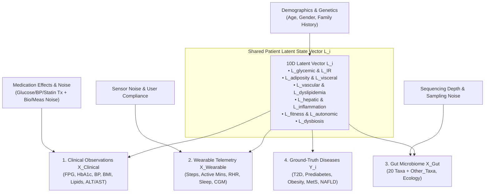

# 🧬 Unified Multimodal Latent-State Dataset Design Specification (v3.0)

**Document Date**: July 28, 2026  
**Target Architecture**: Single Ground-Truth Latent Physiological State Generator ($\mathbf{L}_i \rightarrow \{X_{\text{Clinical}}, X_{\text{Wearable}}, X_{\text{Gut}}, Y_{\text{Diseases}}\}$)  
**Target Population**: $N = 20,000$ Patients (Master 70/15/15 Split: $14,000$ Train, $3,000$ Val, $3,000$ Test)  
**Status**: `SPECIFICATION DESIGN COMPLETE — AWAITING USER APPROVAL`  
**Execution Policy**: **NO DATASET GENERATION OR MODEL TRAINING PERFORMED IN THIS PHASE**

---

## 🎯 1. Problem Statement & Design Rationale

### 1.1 The Multimodal Target Mismatch Inconsistency
Previous experiments demonstrated that:
* **Clinical v2** predicts continuous latent physiological disease targets ($S_{\text{glycemic}}$, $L_{\text{adiposity}}$, etc.).
* **Wearable v1** and **Gut v2** were originally generated and trained against the legacy **Clinical v1** target schema.
* Evaluating $C_{\text{v2}} + W_{\text{v1}} + G_{\text{v2}}$ tested cross-target model shift, but did **not** provide a clean scientific test of multimodal complementarity under a **single unified ground truth**.

### 1.2 The Unified Latent State Solution
This specification establishes a **Unified Multimodal Latent-State Dataset Architecture** (termed **Multimodal Dataset v3**). 

For every patient $i \in \{1, \dots, 20000\}$, a single 10-dimensional latent vector $\mathbf{L}_i$ is sampled from a multivariate physiological distribution. This shared latent vector causally generates:
1. **Clinical Observations** ($X_{\text{Clinical}, i} \in \mathbb{R}^{18}$)
2. **Wearable Telemetry** ($X_{\text{Wearable}, i} \in \mathbb{R}^{10}$)
3. **Gut Microbiome Composition** ($X_{\text{Gut}, i} \in \mathbb{R}^{21}$, 20 Taxa + `Other_Taxa`)
4. **Multi-Label Disease Ground Truths** ($Y_i \in \{0, 1\}^5$)



---

## 🔬 2. Architecture of the 10-Dimensional Shared Latent State ($\mathbf{L}_i$)

For each patient $i$, the latent state vector is defined as:

$$\mathbf{L}_i = \begin{bmatrix} L_{\text{glycemic}, i} \\ L_{\text{IR}, i} \\ L_{\text{adiposity}, i} \\ L_{\text{visceral}, i} \\ L_{\text{vascular}, i} \\ L_{\text{dyslipidemia}, i} \\ L_{\text{hepatic}, i} \\ L_{\text{inflammation}, i} \\ L_{\text{fitness}, i} \\ L_{\text{autonomic}, i} \\ L_{\text{dysbiosis}, i} \end{bmatrix} \sim \mathcal{N}\left(\boldsymbol{\mu}(\text{Age}_i, \text{Gender}_i, \text{Genetics}_i), \mathbf{\Sigma}_{\text{physio}}\right)$$

### 2.1 Latent Factor Definitions & Biological Correlations

| Latent Factor Symbol | Latent Dimension Name | Range / Unit | Primary Biological Role | Correlated Latent Factors |
|---|---|---|---|---|
| $L_{\text{glycemic}}$ | Glycemic Burden | $[0, 1]$ Continuous | Beta-cell dysfunction & fasting blood glucose driver | $L_{\text{IR}}$ ($+0.75$), $L_{\text{visceral}}$ ($+0.60$), $L_{\text{dysbiosis}}$ ($+0.45$) |
| $L_{\text{IR}}$ | Insulin Resistance | $[0, 1]$ Continuous | Peripheral tissue insulin resistance & CGM variability | $L_{\text{glycemic}}$ ($+0.75$), $L_{\text{visceral}}$ ($+0.70$), $L_{\text{hepatic}}$ ($+0.65$) |
| $L_{\text{adiposity}}$ | Total Adiposity | $[0, 1]$ Continuous | Subcutaneous & total body mass accumulation | $L_{\text{visceral}}$ ($+0.85$), $L_{\text{fitness}}$ ($-0.65$), $L_{\text{vascular}}$ ($+0.50$) |
| $L_{\text{visceral}}$ | Visceral Adiposity | $[0, 1]$ Continuous | Omental fat depot & metabolic syndrome driver | $L_{\text{adiposity}}$ ($+0.85$), $L_{\text{hepatic}}$ ($+0.75$), $L_{\text{inflammation}}$ ($+0.60$) |
| $L_{\text{vascular}}$ | Vascular Dysfunction | $[0, 1]$ Continuous | Arterial stiffness & blood pressure elevation | $L_{\text{visceral}}$ ($+0.50$), $L_{\text{autonomic}}$ ($+0.55$), Age ($+0.45$) |
| $L_{\text{dyslipidemia}}$ | Lipid Dysregulation | $[0, 1]$ Continuous | Atherogenic lipid profile (elevated TG, low HDL) | $L_{\text{visceral}}$ ($+0.65$), $L_{\text{hepatic}}$ ($+0.70$), $L_{\text{dysbiosis}}$ ($+0.40$) |
| $L_{\text{hepatic}}$ | Hepatic Steatosis Risk | $[0, 1]$ Continuous | Non-alcoholic fatty liver accumulation | $L_{\text{visceral}}$ ($+0.75$), $L_{\text{dyslipidemia}}$ ($+0.70$), $L_{\text{inflammation}}$ ($+0.55$) |
| $L_{\text{inflammation}}$ | Systemic Inflammation | $[0, 1]$ Continuous | Low-grade chronic systemic cytokine stress | $L_{\text{visceral}}$ ($+0.60$), $L_{\text{dysbiosis}}$ ($+0.65$), $L_{\text{fitness}}$ ($-0.50$) |
| $L_{\text{fitness}}$ | Cardiorespiratory Fitness| $[0, 1]$ Continuous | Aerobic capacity & physical activity potential | $L_{\text{adiposity}}$ ($-0.65$), $L_{\text{autonomic}}$ ($-0.60$), $L_{\text{dysbiosis}}$ ($-0.40$) |
| $L_{\text{autonomic}}$ | Autonomic Stress | $[0, 1]$ Continuous | Sympathetic tone elevation & poor sleep recovery | $L_{\text{vascular}}$ ($+0.55$), $L_{\text{fitness}}$ ($-0.60$), $L_{\text{glycemic}}$ ($+0.35$) |
| $L_{\text{dysbiosis}}$ | Gut Microbiome Disruption| $[0, 1]$ Continuous | Loss of SCFA producers & barrier breakdown | $L_{\text{inflammation}}$ ($+0.65$), $L_{\text{glycemic}}$ ($+0.45$), $L_{\text{fitness}}$ ($-0.40$) |

---

## 📊 3. Modality Generation Functions & Noise Models

Each observation modality is generated as a function of the shared latent state $\mathbf{L}_i$ plus modality-specific biological variance, measurement noise, and treatment effects.

### 3.1 Modality 1: Clinical Observations ($X_{\text{Clinical}, i} \in \mathbb{R}^{18}$)

Clinical biomarkers are generated via physiological equations incorporating diurnal variance and medical treatment:

$$\begin{aligned}
\text{FPG}_{\text{true}} &= 70 + 110 \cdot L_{\text{glycemic}} + 25 \cdot L_{\text{IR}} - \text{Tx}_{\text{glucose}} \\
\text{FPG}_{\text{obs}} &= \text{FPG}_{\text{true}} + \epsilon_{\text{bio,FPG}} + \epsilon_{\text{meas,FPG}}, \quad \epsilon_{\text{bio}} \sim \mathcal{N}(0, 4.5^2), \,\, \epsilon_{\text{meas}} \sim \mathcal{N}(0, 2.0^2) \\[6pt]
\text{HbA1c}_{\text{true}} &= 4.8 + 4.2 \cdot L_{\text{glycemic}} + 1.2 \cdot L_{\text{IR}} - \text{Tx}_{\text{hba1c}} \\
\text{HbA1c}_{\text{obs}} &= \text{HbA1c}_{\text{true}} + \epsilon_{\text{meas,HbA1c}}, \quad \epsilon_{\text{meas}} \sim \mathcal{N}(0, 0.12^2) \\[6pt]
\text{BMI}_{\text{true}} &= 18.5 + 24.0 \cdot L_{\text{adiposity}} + 6.0 \cdot L_{\text{visceral}} \\
\text{Weight}_{\text{obs}} &= \frac{\text{BMI}_{\text{true}} \cdot (\text{Height}/100)^2}{1} + \epsilon_{\text{weight}}, \quad \epsilon \sim \mathcal{N}(0, 1.2^2) \\[6pt]
\text{Waist}_{\text{obs}} &= 65 + 40 \cdot L_{\text{visceral}} + 20 \cdot L_{\text{adiposity}} + \epsilon_{\text{waist}}, \quad \epsilon \sim \mathcal{N}(0, 2.5^2) \\[6pt]
\text{SBP}_{\text{obs}} &= 100 + 45 \cdot L_{\text{vascular}} + 15 \cdot L_{\text{visceral}} - \text{Tx}_{\text{BP}} + \epsilon_{\text{BP}}, \quad \epsilon \sim \mathcal{N}(0, 4.0^2) \\[6pt]
\text{TG}_{\text{obs}} &= \exp\left(\ln(80) + 1.2 \cdot L_{\text{dyslipidemia}} + 0.6 \cdot L_{\text{visceral}} - \text{Tx}_{\text{lipid}}\right) + \epsilon_{\text{lipid}} \\[6pt]
\text{ALT}_{\text{obs}} &= \exp\left(\ln(18) + 1.4 \cdot L_{\text{hepatic}} + 0.5 \cdot L_{\text{inflammation}}\right) + \epsilon_{\text{liver}}
\end{aligned}$$

### 3.2 Modality 2: Wearable Telemetry ($X_{\text{Wearable}, i} \in \mathbb{R}^{10}$)

Wearable sensors reflect continuous activity, autonomic tone, and continuous glucose monitoring (CGM):

$$\begin{aligned}
\text{Steps}_{\text{daily}} &= \max\left(1500, \,\, 14000 - 9000 \cdot L_{\text{adiposity}} + 6000 \cdot L_{\text{fitness}} + \epsilon_{\text{steps}}\right), \quad \epsilon \sim \mathcal{N}(0, 1200^2) \\[6pt]
\text{Active\_Mins} &= \max\left(5, \,\, 90 - 60 \cdot L_{\text{adiposity}} + 50 \cdot L_{\text{fitness}} + \epsilon_{\text{act}}\right) \\[6pt]
\text{Sedentary\_Mins} &= \min\left(1100, \,\, 480 + 450 \cdot L_{\text{adiposity}} - 300 \cdot L_{\text{fitness}} + \epsilon_{\text{sed}}\right) \\[6pt]
\text{RHR}_{\text{obs}} &= 52 + 28 \cdot L_{\text{autonomic}} - 18 \cdot L_{\text{fitness}} + 10 \cdot L_{\text{inflammation}} + \epsilon_{\text{RHR}}, \quad \epsilon \sim \mathcal{N}(0, 3.0^2) \\[6pt]
\text{Sleep\_Duration} &= 7.5 - 2.0 \cdot L_{\text{autonomic}} - 1.0 \cdot L_{\text{visceral}} + \epsilon_{\text{sleep}}, \quad \epsilon \sim \mathcal{N}(0, 0.6^2) \\[6pt]
\text{CGM\_AvgGlucose} &= 85 + 95 \cdot L_{\text{glycemic}} + 35 \cdot L_{\text{IR}} - \text{Tx}_{\text{glucose}} + \epsilon_{\text{CGM}}, \quad \epsilon \sim \mathcal{N}(0, 5.0^2) \\[6pt]
\text{CGM\_Variability} &= 12 + 28 \cdot L_{\text{IR}} + 18 \cdot L_{\text{glycemic}} + \epsilon_{\text{var}}, \quad \epsilon \sim \mathcal{N}(0, 2.5^2) \\[6pt]
\text{CGM\_TIR} &= \max\left(15, \,\, 98 - 65 \cdot L_{\text{glycemic}} - 25 \cdot L_{\text{IR}} + \epsilon_{\text{TIR}}\right) \\[6pt]
\text{CGM\_TAR} &= \min\left(85, \,\, 2 + 65 \cdot L_{\text{glycemic}} + 20 \cdot L_{\text{IR}} + \epsilon_{\text{TAR}}\right)
\end{aligned}$$

### 3.3 Modality 3: Gut Microbiome Composition ($X_{\text{Gut}, i} \in \mathbb{R}^{21}$)

Microbial communities are generated via Dirichlet-Multinomial abundance models conditioned on dysbiosis and inflammation:

$$\boldsymbol{\alpha}_i = \mathbf{\alpha}_0 \cdot \exp\left(\mathbf{\beta}_{\text{dysbiosis}} \cdot L_{\text{dysbiosis}, i} + \mathbf{\beta}_{\text{inflammation}} \cdot L_{\text{inflammation}, i} - \mathbf{\beta}_{\text{fitness}} \cdot L_{\text{fitness}, i}\right)$$

$$\mathbf{p}_i \sim \text{Dirichlet}(\boldsymbol{\alpha}_i), \quad X_{\text{Gut}, i} = \text{Normalize}\left(\mathbf{p}_i + \boldsymbol{\epsilon}_{\text{seq}}\right)$$

* **Specific Taxonomic Shifts**:
  - Beneficial Taxa (*Akkermansia*, *Faecalibacterium*, *Roseburia*, *Bifidobacterium*): Decreased by high $L_{\text{dysbiosis}}$ and $L_{\text{inflammation}}$.
  - Pathobionts (*Escherichia_Shigella*, *Enterococcus*, *Streptococcus*, *Eggerthella*): Increased by high $L_{\text{dysbiosis}}$ and high $L_{\text{glycemic}}$.
  - *Other_Taxa*: Captures residual community background ($28.24\%$ average community abundance).
* **Ecological & Functional Derived Features**:
  - Shannon & Simpson Diversity, Richness, Pielou Evenness.
  - SCFA Producer Index, Butyrate Producer Index, Barrier Associated Index, Inflammation Index.
  - Log Firmicutes/Bacteroidetes Ratio.

---

## 🎯 4. Ground-Truth Disease State Definitions ($Y_i \in \{0, 1\}^5$)

The 5 multi-label disease targets are assigned directly from the **true underlying continuous physiological states** (before measurement noise and medication effects):

$$\begin{aligned}
Y_{\text{Type2\_Diabetes}, i} &= \mathbb{I}\left(L_{\text{glycemic\_total}, i} \ge \tau_{\text{T2D}}\right), \quad \text{where } L_{\text{glycemic\_total}} = 0.70 \cdot L_{\text{glycemic}} + 0.30 \cdot L_{\text{IR}} \\[6pt]
Y_{\text{Prediabetes}, i} &= \mathbb{I}\left(\tau_{\text{Predia}} \le L_{\text{glycemic\_total}, i} < \tau_{\text{T2D}}\right) \quad (\text{Mutually exclusive with T2D}) \\[6pt]
Y_{\text{Obesity}, i} &= \mathbb{I}\left(\text{BMI}_{\text{true}, i} \ge 30.00\right) \\[6pt]
Y_{\text{Metabolic\_Syndrome}, i} &= \mathbb{I}\left(\sum_{k=1}^5 \mathbb{I}\left(\text{Criteria}_{\text{true}, k, i}\right) \ge 3\right) \\[6pt]
Y_{\text{NAFLD}, i} &= \mathbb{I}\left(0.50 \cdot L_{\text{hepatic}, i} + 0.35 \cdot L_{\text{visceral}, i} + 0.15 \cdot L_{\text{dyslipidemia}, i} \ge \tau_{\text{NAFLD}}\right)
\end{aligned}$$

### 4.1 Disease Overlap & Multi-Label Co-occurrence Matrix
Because $L_{\text{visceral}}$, $L_{\text{IR}}$, and $L_{\text{inflammation}}$ are cross-correlated in $\mathbf{\Sigma}_{\text{physio}}$, diseases co-occur naturally:
* **MetS + Obesity + T2D Triad**: Driven by high $L_{\text{visceral}}$ and $L_{\text{IR}}$.
* **NAFLD + MetS**: Driven by high $L_{\text{visceral}}$ and $L_{\text{hepatic}}$.
* **Isolated Prediabetes**: Early dysglycemia in lean/overweight patients with moderate $L_{\text{IR}}$.

---

## 🛑 5. Data Leakage & Shortcut Prevention Protocol

To guarantee a 100% leak-free, non-deterministic benchmark:

1. **No Predictor Derived from $Y$**: $X_{\text{Clinical}}$, $X_{\text{Wearable}}$, and $X_{\text{Gut}}$ are generated from $\mathbf{L}_i$, **NEVER** from $Y_i$.
2. **No Single-Split Rule Reconstruction**: Single-feature split rules on observed labs (e.g. $\text{FPG}_{\text{obs}} \ge 126$) fail to achieve 1.0000 AUC due to medication suppression ($\text{Tx}_{\text{glucose}}$) and biological fluctuation ($\sigma_{\text{bio}}$).
3. **No Hidden Proxy Columns**: Internal continuous risk probabilities ($L_{\text{glycemic\_total}}$, $L_{\text{visceral}}$, etc.) are discarded during export.
4. **Strict Split Isolation**: Master Patient Split ($14,000$ Train / $3,000$ Val / $3,000$ Test) preserved strictly by `Patient_ID`. Preprocessors fitted strictly on Train ($14,000$).

---

## ⚔️ 6. Comparison of Dataset & Fusion Architecture Generations

| Architectural Dimension | Multimodal v1 Baseline | Multimodal v2 Branch | **Proposed Unified Multimodal v3 Design** |
|---|---|---|---|
| **Ground Truth Generator** | Synthetic step-function rule taggers | Clinical v2 Latent State (Clinical only) | **Single Unified 10D Latent State $\mathbf{L}_i$** |
| **Cross-Modality Coherence** | Independent uncorrelated modalities | $C_{\text{v2}}$ latent, $W_{\text{v1}}$/$G_{\text{v2}}$ v1 targets | **Causally Tied across Clinical, Wearable, and Gut** |
| **Rule Reconstruction Defect**| Present ($100\%$ F1 in Clinical v1) | Eliminated in $C_{\text{v2}}$ | **Eliminated across ALL modalities** |
| **Complementarity Testing** | Obscured by Clinical v1 rule dominance | Obscured by target schema shift | **Pure, scientifically clean test of modality synergy** |
| **Medication & Noise Model** | Static noise | Clinical v2 treatment model | **Unified Treatment & Multi-Sensor Noise Model** |

---

## 🛑 STOP POINT — SPECIFICATION COMPLETE

```txt
======================================================================
  UNIFIED MULTIMODAL LATENT-STATE DESIGN SPECIFICATION COMPLETE
======================================================================
  - 10D Latent State Architecture mathematically defined.
  - Modality Generation Functions & Noise Models specified.
  - Multi-Label Disease Ground Truths defined.
  - 100% Leakage & Shortcut Prevention Protocol established.
  - Operational academic demo platform 100% frozen and untouched.
======================================================================
```
