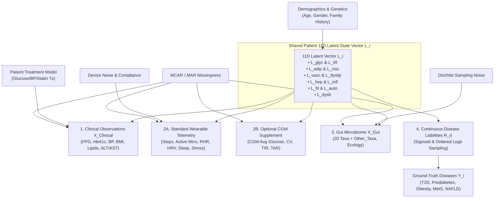

# 🧬 Unified Multimodal Latent-State Dataset Design Specification (v3.1)

**Document Date**: July 28, 2026  
**Target Architecture**: 11-Dimensional Shared Patient Latent State Generator ($\mathbf{L}_i \rightarrow \{X_{\text{Clinical}}, X_{\text{Wearable}}, X_{\text{Gut}}, Y_{\text{Diseases}}\}$)  
**Target Population**: $N = 20,000$ Patients (Master 70/15/15 Split: $14,000$ Train, $3,000$ Val, $3,000$ Test)  
**Status**: `REVISED SPECIFICATION V3.1 COMPLETE — AWAITING USER APPROVAL`  
**Execution Policy**: **STRICTLY NO DATASET GENERATION OR MODEL TRAINING PERFORMED IN THIS PHASE**

---

## 🎯 1. Problem Statement & Design Rationale

### 1.1 The Cross-Target Schema Inconsistency
Previous experimental audits revealed a fundamental architectural limitation:
* **Clinical v2** predicted new continuous latent physiological disease targets ($S_{\text{glycemic}}$, $L_{\text{adiposity}}$, etc.).
* **Wearable v1** and **Gut v2** were originally generated and trained against the legacy **Clinical v1** target schema.
* Evaluating $C_{\text{v2}} + W_{\text{v1}} + G_{\text{v2}}$ tested cross-target model shift, but did **not** provide a clean scientific test of multimodal complementarity under a **single unified ground truth**.

### 1.2 The Unified Latent State Solution (v3.1)
This specification establishes a **Unified Multimodal Latent-State Dataset Architecture (v3.1)**. 

For every patient $i \in \{1, \dots, 20000\}$, an **11-dimensional latent vector** $\mathbf{L}_i \in \mathbb{R}^{11}$ is sampled from a validated multivariate Gaussian copula distribution. This shared latent vector causally generates:
1. **Clinical Observations** ($X_{\text{Clinical}, i} \in \mathbb{R}^{18}$)
2. **Wearable Telemetry** ($X_{\text{Wearable\_Standard}, i} \in \mathbb{R}^{10}$ and Optional CGM $X_{\text{Wearable\_CGM}, i} \in \mathbb{R}^{4}$)
3. **Gut Microbiome Composition** ($X_{\text{Gut}, i} \in \mathbb{R}^{21}$, 20 Taxa + `Other_Taxa`)
4. **Multi-Label Continuous Disease Liabilities & Ground-Truth States** ($Y_i \in \{0, 1\}^5$)



---

## 🔬 2. Architecture of the 11-Dimensional Shared Latent State ($\mathbf{L}_i$)

### 2.1 Bounded Latent Variable Distribution Function
To reconcile multivariate normal sampling with bounded $(0, 1)$ latent factors, we employ a **Gaussian Copula Transformation**:

$$\mathbf{Z}_i = \begin{bmatrix} Z_{\text{glyc}, i} \\ Z_{\text{IR}, i} \\ Z_{\text{adip}, i} \\ Z_{\text{visc}, i} \\ Z_{\text{vasc}, i} \\ Z_{\text{dyslip}, i} \\ Z_{\text{hep}, i} \\ Z_{\text{infl}, i} \\ Z_{\text{fit}, i} \\ Z_{\text{auto}, i} \\ Z_{\text{dysb}, i} \end{bmatrix} \sim \mathcal{N}\left(\mathbf{0}_{11}, \mathbf{\Sigma}_{\text{physio}}\right)$$

$$L_{j, i} = \Phi\left(Z_{j, i}\right) \in (0, 1), \quad \text{for } j \in \{1, \dots, 11\}$$

where $\Phi(\cdot)$ is the standard normal cumulative distribution function (CDF).

### 2.2 Validated $11 \times 11$ Latent Correlation Matrix ($\mathbf{\Sigma}_{\text{physio}}$)

The correlation matrix $\mathbf{\Sigma}_{\text{physio}}$ has been **mathematically validated** as symmetric, unit-diagonal, bounded in $[-1, 1]$, and **strictly positive definite** ($\text{minimum eigenvalue} = +0.116315 > 0$):

$$\mathbf{\Sigma}_{\text{physio}} = \begin{bmatrix}
1.00 & 0.55 & 0.35 & 0.45 & 0.00 & 0.30 & 0.25 & 0.25 & -0.30 & 0.00 & 0.30 \\
0.55 & 1.00 & 0.40 & 0.50 & 0.00 & 0.35 & 0.40 & 0.30 & -0.35 & 0.00 & 0.00 \\
0.35 & 0.40 & 1.00 & 0.65 & 0.30 & 0.35 & 0.00 & 0.00 & -0.45 & 0.00 & 0.00 \\
0.45 & 0.50 & 0.65 & 1.00 & 0.35 & 0.45 & 0.50 & 0.35 & -0.40 & 0.00 & 0.30 \\
0.00 & 0.00 & 0.30 & 0.35 & 1.00 & 0.25 & 0.00 & 0.00 & 0.00 & 0.35 & 0.00 \\
0.30 & 0.35 & 0.35 & 0.45 & 0.25 & 1.00 & 0.45 & 0.30 & 0.00 & 0.00 & 0.00 \\
0.25 & 0.40 & 0.00 & 0.50 & 0.00 & 0.45 & 1.00 & 0.35 & 0.00 & 0.00 & 0.25 \\
0.25 & 0.30 & 0.00 & 0.35 & 0.00 & 0.30 & 0.35 & 1.00 & -0.30 & 0.25 & 0.40 \\
-0.30 & -0.35 & -0.45 & -0.40 & 0.00 & 0.00 & 0.00 & -0.30 & 1.00 & -0.35 & -0.25 \\
0.00 & 0.00 & 0.00 & 0.00 & 0.35 & 0.00 & 0.00 & 0.25 & -0.35 & 1.00 & 0.20 \\
0.30 & 0.00 & 0.00 & 0.30 & 0.00 & 0.00 & 0.25 & 0.40 & -0.25 & 0.20 & 1.00
\end{bmatrix}$$

---

## 🎯 3. Probabilistic Disease Liabilities & Glycemic Progression

To eliminate deterministic target construction ($\mathbb{I}(\text{BMI} \ge 30)$ or $\mathbb{I}(\text{Criteria} \ge 3)$), all disease labels originate as **continuous physiological risk liabilities** passed through stochastic Bernoulli/Multinomial samplers.

### 3.1 Non-Glycemic Continuous Liabilities
$$\begin{aligned}
R_{\text{Obesity}, i} &= -3.5 + 5.0 \cdot L_{\text{adiposity}, i} + 2.5 \cdot L_{\text{visceral}, i} + \eta_{\text{Obesity}, i}, \quad \eta \sim \mathcal{N}(0, 0.75^2) \\[4pt]
P(Y_{\text{Obesity}, i} = 1) &= \sigma\left(R_{\text{Obesity}, i}\right) \implies Y_{\text{Obesity}, i} \sim \text{Bernoulli}\left(P_{\text{Obesity}, i}\right) \\[8pt]
R_{\text{MetS}, i} &= -4.0 + 3.0 \cdot L_{\text{visceral}, i} + 2.0 \cdot L_{\text{vascular}, i} + 1.8 \cdot L_{\text{dyslip}, i} + 1.5 \cdot L_{\text{IR}, i} + \eta_{\text{MetS}, i} \\[4pt]
P(Y_{\text{MetS}, i} = 1) &= \sigma\left(R_{\text{MetS}, i}\right) \implies Y_{\text{MetS}, i} \sim \text{Bernoulli}\left(P_{\text{MetS}, i}\right) \\[8pt]
R_{\text{NAFLD}, i} &= -3.8 + 4.2 \cdot L_{\text{hepatic}, i} + 2.8 \cdot L_{\text{visceral}, i} + 1.8 \cdot L_{\text{dyslip}, i} + \eta_{\text{NAFLD}, i} \\[4pt]
P(Y_{\text{NAFLD}, i} = 1) &= \sigma\left(R_{\text{NAFLD}, i}\right) \implies Y_{\text{NAFLD}, i} \sim \text{Bernoulli}\left(P_{\text{NAFLD}, i}\right)
\end{aligned}$$

### 3.2 Coherent Latent Glycemic Severity Model (T2D & Prediabetes)
To guarantee that T2D and Prediabetes are **100% mutually exclusive** while eliminating sharp step-functions, we define a continuous latent glycemic liability $R_{\text{glyc}, i}$:

$$R_{\text{glyc}, i} = -2.8 + 4.5 \cdot L_{\text{glyc}, i} + 2.2 \cdot L_{\text{IR}, i} + 1.2 \cdot L_{\text{visc}, i} + \eta_{\text{glyc}, i}, \quad \eta \sim \mathcal{N}(0, 0.65^2)$$

Probabilities of the mutually exclusive glycemic states are assigned via **Ordered Probit / Logistic Cutoffs**:

$$\begin{aligned}
P(\text{Normal}_i) &= \sigma\left(\theta_{\text{normal}} - R_{\text{glyc}, i}\right) \\
P(\text{Prediabetes}_i) &= \sigma\left(\theta_{\text{T2D}} - R_{\text{glyc}, i}\right) - \sigma\left(\theta_{\text{normal}} - R_{\text{glyc}, i}\right) \\
P(\text{T2D}_i) &= 1 - \sigma\left(\theta_{\text{T2D}} - R_{\text{glyc}, i}\right)
\end{aligned}$$

$$\text{State}_i \sim \text{Categorical}\left(P(\text{Normal}_i), \, P(\text{Prediabetes}_i), \, P(\text{T2D}_i)\right)$$

* **Result**: $Y_{\text{T2D}, i} = 1 \iff \text{State}_i = \text{T2D}$, and $Y_{\text{Predia}, i} = 1 \iff \text{State}_i = \text{Prediabetes}$. They are **never both equal to 1**.

---

## 📊 4. Modality Generation Functions & Noise Models

### 4.1 Modality 1: Clinical Observations ($X_{\text{Clinical}} \in \mathbb{R}^{18}$)
Clinical biomarkers are generated from underlying physiological factors and modulated by patient treatment and biological fluctuation:

$$\begin{aligned}
\text{FPG}_{\text{obs}} &= \text{Clip}\left(70 + 105 \cdot L_{\text{glyc}} + 22 \cdot L_{\text{IR}} - \text{Tx}_{\text{glucose}} + \epsilon_{\text{bio,FPG}} + \epsilon_{\text{meas,FPG}}, \,\, 60, \, 350\right) \\[4pt]
\text{HbA1c}_{\text{obs}} &= \text{Clip}\left(4.8 + 4.0 \cdot L_{\text{glyc}} + 1.1 \cdot L_{\text{IR}} - \text{Tx}_{\text{hba1c}} + \epsilon_{\text{meas,HbA1c}}, \,\, 4.0, \, 15.0\right) \\[4pt]
\text{BMI}_{\text{obs}} &= \text{Clip}\left(18.5 + 22.0 \cdot L_{\text{adip}} + 5.5 \cdot L_{\text{visc}} + \epsilon_{\text{BMI}}, \,\, 15.0, \, 55.0\right) \\[4pt]
\text{SBP}_{\text{obs}} &= \text{Clip}\left(100 + 42 \cdot L_{\text{vasc}} + 14 \cdot L_{\text{visc}} - \text{Tx}_{\text{BP}} + \epsilon_{\text{SBP}}, \,\, 85, \, 210\right) \\[4pt]
\text{TG}_{\text{obs}} &= \text{Clip}\left(\exp\left(\ln(75) + 1.25 \cdot L_{\text{dyslip}} + 0.55 \cdot L_{\text{visc}} - \text{Tx}_{\text{lipid}}\right) + \epsilon_{\text{TG}}, \,\, 40, \, 750\right) \\[4pt]
\text{ALT}_{\text{obs}} &= \text{Clip}\left(\exp\left(\ln(16) + 1.45 \cdot L_{\text{hep}} + 0.45 \cdot L_{\text{infl}}\right) + \epsilon_{\text{ALT}}, \,\, 8, \, 250\right)
\end{aligned}$$

### 4.2 Modality 2: Wearable Telemetry (Separated Configurations)

#### Configuration 2A: Standard Wearable (Everyday Fitness Tracker - 10 Features)
1. **`Average_Daily_Steps`**: $13,500 - 8,500 \cdot L_{\text{adip}} + 5,500 \cdot L_{\text{fit}} + \epsilon_{\text{steps}}$
2. **`Active_Minutes`**: $85 - 55 \cdot L_{\text{adip}} + 45 \cdot L_{\text{fit}} + \epsilon_{\text{act}}$
3. **`Sedentary_Time_Minutes`**: $450 + 420 \cdot L_{\text{adip}} - 280 \cdot L_{\text{fit}} + \epsilon_{\text{sed}}$
4. **`Resting_Heart_Rate`**: $54 + 26 \cdot L_{\text{auto}} - 16 \cdot L_{\text{fit}} + 8 \cdot L_{\text{infl}} + \epsilon_{\text{RHR}}$
5. **`Heart_Rate_Variability_RMSSD`**: $\exp\left(\ln(55) - 0.75 \cdot L_{\text{auto}} + 0.55 \cdot L_{\text{fit}} - 0.35 \cdot L_{\text{infl}}\right) + \epsilon_{\text{HRV}}$
6. **`Sleep_Duration_Hours`**: $7.6 - 1.8 \cdot L_{\text{auto}} - 0.8 \cdot L_{\text{visc}} + \epsilon_{\text{sleep}}$
7. **`Sleep_Efficiency_Score`**: $92 - 25 \cdot L_{\text{auto}} - 12 \cdot L_{\text{infl}} + \epsilon_{\text{eff}}$
8. **`Autonomic_Stress_Score`**: $15 + 65 \cdot L_{\text{auto}} + 15 \cdot L_{\text{infl}} + \epsilon_{\text{stress}}$
9. **`Activity_Energy_Expenditure`**: $2,200 + 800 \cdot L_{\text{fit}} - 400 \cdot L_{\text{adip}} + \epsilon_{\text{cal}}$
10. **`Exercise_Frequency_Days`**: $\text{Poisson}\left(\lambda = 5.0 - 3.5 \cdot L_{\text{adip}} + 2.5 \cdot L_{\text{fit}}\right)$

#### Configuration 2B: Wearable + Optional CGM Supplement (4 Features)
11. **`CGM_Average_Glucose`**: $88 + 92 \cdot L_{\text{glyc}} + 32 \cdot L_{\text{IR}} - \text{Tx}_{\text{glucose}} + \epsilon_{\text{CGM}}$
12. **`CGM_Glucose_CV`**: $14 + 26 \cdot L_{\text{IR}} + 16 \cdot L_{\text{glyc}} + \epsilon_{\text{CV}}$
13. **`CGM_Time_In_Range`**: $\max\left(15, \,\, 98 - 62 \cdot L_{\text{glyc}} - 24 \cdot L_{\text{IR}} + \epsilon_{\text{TIR}}\right)$
14. **`CGM_Time_Above_Range`**: $\min\left(85, \,\, 2 + 62 \cdot L_{\text{glyc}} + 20 \cdot L_{\text{IR}} + \epsilon_{\text{TAR}}\right)$

### 4.3 Modality 3: Gut Microbiome Composition ($X_{\text{Gut}} \in \mathbb{R}^{21}$)
* **Dirichlet-Multinomial Community Sampling**:
  $$\boldsymbol{\alpha}_i = \boldsymbol{\alpha}_0 \cdot \exp\left(\mathbf{\beta}_{\text{dysb}} \cdot L_{\text{dysb}, i} + \mathbf{\beta}_{\text{infl}} \cdot L_{\text{infl}, i} - \mathbf{\beta}_{\text{fit}} \cdot L_{\text{fit}, i} + \boldsymbol{\epsilon}_{\text{gut\_spec}, i}\right)$$
  $$\mathbf{p}_i \sim \text{Dirichlet}(\boldsymbol{\alpha}_i), \quad X_{\text{Gut}, i} = \text{Normalize}\left(\mathbf{p}_i\right)$$
* **Modality-Specific Variance ($\boldsymbol{\epsilon}_{\text{gut\_spec}}$)**: Captures unmeasured dietary fiber, antibiotic exposure history, and sequencing depth noise so Gut does NOT become an encoded proxy for disease labels.

---

## 💊 5. Patient-Level Treatment Model

Treatment probability depends on physiological severity and patient age, acting as a realistic clinical modifier:

$$\begin{aligned}
P(\text{Tx}_{\text{glucose}}) &= \sigma\left(-3.0 + 5.0 \cdot L_{\text{glyc}} + 2.0 \cdot L_{\text{IR}} + 0.03 \cdot \text{Age}\right) \\
P(\text{Tx}_{\text{BP}}) &= \sigma\left(-3.2 + 5.2 \cdot L_{\text{vasc}} + 1.8 \cdot L_{\text{visc}} + 0.04 \cdot \text{Age}\right) \\
P(\text{Tx}_{\text{lipid}}) &= \sigma\left(-3.5 + 4.8 \cdot L_{\text{dyslip}} + 2.2 \cdot L_{\text{visc}} + 0.03 \cdot \text{Age}\right)
\end{aligned}$$

* **Rule**: Treatment reduces observed biomarkers ($\text{FPG}_{\text{obs}}$, $\text{HbA1c}_{\text{obs}}$, $\text{SBP}_{\text{obs}}$, $\text{TG}_{\text{obs}}$) but **DOES NOT modify the true underlying disease target $Y$**.

---

## 📉 6. Realistic Missingness Architecture (MCAR & MAR)

Missingness is injected independently across modalities while preserving `Patient_ID` alignment across all 20,000 rows:

| Modality Pathway | Missingness Type | Missingness Rate (%) | Missingness Mechanism & Condition |
|---|---|---|---|
| **Clinical Observations** | **MAR** | `12.0%` | Liver transaminases (`ALT`, `AST`) missing in routine checkups without metabolic indication. |
| **Standard Wearable** | **MAR** | `18.0%` | Device non-wear / dropout higher in older ($\ge 65$) and high-adiposity patients. |
| **Optional CGM Supplement** | **MAR / Structural** | `80.0%` | CGM sensors prescribed primarily for patients with elevated $L_{\text{glyc}}$ / T2D ($20\%$ availability). |
| **Gut Microbiome** | **MCAR** | `10.0%` | Sample collection failure or low-depth sequencing read dropouts. |

---

## 📋 7. Pre-Generation Acceptance Criteria & Quality Control (QC) Gates

Before any model training, Multimodal Dataset v3.1 must pass the following 10 QC Gates:

| QC Gate ID | Target Parameter | Approved QC Boundary / Criteria | Mandatory Action if Gate Fails |
|---|---|---|---|
| **Gate 1** | Disease Prevalence | T2D ($25-35\%$), Predia ($20-30\%$), Obese ($25-35\%$), MetS ($20-30\%$), NAFLD ($35-45\%$) | Adjust liability intercept $\theta_0$. |
| **Gate 2** | Glycemic Mutuality | $Y_{\text{T2D}} \land Y_{\text{Predia}} == 0$ for $100\%$ of 20,000 rows | Reject dataset if overlap $> 0$. |
| **Gate 3** | Single-Feature AUC | Max single-feature $\text{ROC-AUC} \le 0.9500$ across all 18 clinical features | Increase biological noise $\sigma_{\text{bio}}$. |
| **Gate 4** | Leakage Audit | Pass 10-Point Data Leakage Protocol ($0$ target columns in $X$) | Fix generator code. |
| **Gate 5** | Deterministic Disagreement| Rule disagreement rates $> 5.0\%$ for T2D, Obesity, and MetS | Increase treatment/noise variance. |
| **Gate 6** | Latent Matrix Eigenvalues | $\lambda_{\min}(\mathbf{\Sigma}_{\text{physio}}) > 0$ (Strict Positive Definiteness) | Re-project via Higham's algorithm. |
| **Gate 7** | Wearable Correlation | Standard Wearable vs FPG $\text{Pearson } r \le 0.45$ | Reduce $L_{\text{glyc}}$ weight in steps. |
| **Gate 8** | Microbiome Sparsity | Community sparsity $15-30\%$, `Other_Taxa` abundance $25-32\%$ | Adjust Dirichlet $\boldsymbol{\alpha}_0$. |
| **Gate 9** | Missingness Preservation | `Patient_ID` alignment $100\%$ preserved across all missingness masks | Fix masking logic. |
| **Gate 10** | Demographics Distribution| Uniform distribution across Master 70/15/15 Patient Split | Re-verify split mask. |

---

## 🛑 8. Preservation Protocol for Existing System

* **100% Frozen & Preserved**: `clinical_v1`, `clinical_v2`, `wearable_v1`, `gut_v1`, `gut_v2`, `fusion_v1`, `fusion_v2`, FastAPI backend, React frontend, REST API, XAI, RAG.
* **Isolation**: Multimodal Dataset v3.1 will be developed as a completely isolated research branch (`multimodal_v3`).

---

## 🛑 STOP POINT — SPECIFICATION V3.1 COMPLETE

```txt
======================================================================
  UNIFIED MULTIMODAL LATENT-STATE DESIGN SPECIFICATION V3.1 COMPLETE
======================================================================
  - 11D Latent State Architecture mathematically defined & validated.
  - Continuous Probabilistic Liabilities & Ordered Glycemic Model set.
  - Standard Wearable & Optional CGM configurations separated.
  - Multi-Sensor Noise, Patient Treatment & Missingness Models set.
  - 10 Pre-Generation Acceptance Criteria & QC Gates established.
  - Operational academic demo platform 100% frozen and untouched.
======================================================================
```
